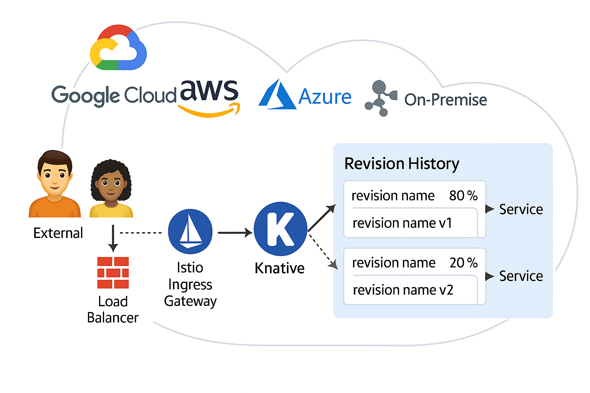

# Knative + Istio + Canary Deployment Example

## Visão Geral

Este projeto demonstra uma arquitetura moderna baseada em **Knative** e **Istio** rodando em um cluster **Kubernetes** com suporte a múltiplas plataformas de nuvem (Google Cloud, AWS, Azure) e ambientes On-Premises.

A solução permite deploys serverless e gerenciamento de tráfego com controle granular por revisão usando recursos como:

- **Knative Serving** para deploys serverless e gestão de revisões.
- **Istio** para roteamento de tráfego inteligente e observabilidade.
- **Canary deployment** com distribuição de tráfego entre múltiplas versões de uma aplicação.

## Topologia

A imagem abaixo representa de maneira bem resumia a topologia de rede e fluxo de tráfego com Knative e Istio, incluindo um exemplo de Canary Deployment onde 80% do tráfego vai para a `revision v1` e 20% para a `revision v2`.

## Requisitos

- Kubernetes cluster (GKE, EKS, AKS ou On-Premise)
- Istio instalado
- Knative Serving instalado

## Exemplo de Deploy

Você pode utilizar a configuração do chart incluído nesse repo como base para um serviço com canary deployment:

Criei uma demo simples em helm, com opção para habilitar canaray deployment ou não, chamando variáveis (no hardcode guys, fica a fica), bem genérica para qualquer time poder utilizar.

Para fins de deste utilizei duas imagens públicas, totalmente funcional, basicamente você só edita o values.yaml de acordo com as necessidades do seu ambiente.

Como opcional ele cria um virtual service dinâmico caso queira criar regras de roteamento, path uri, header, etc.

Agora é só parametrizar e refatorar para ser deployada na sua esteira desejada (Gitlab, Jenkins, etc)

(Arquitetura do Knative, Istio e detalhes técnicos você encontra nas documentações oficiais das soluções.)
